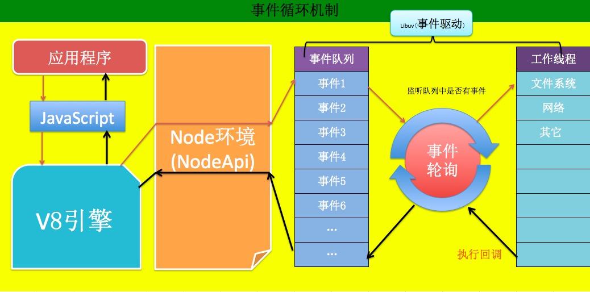
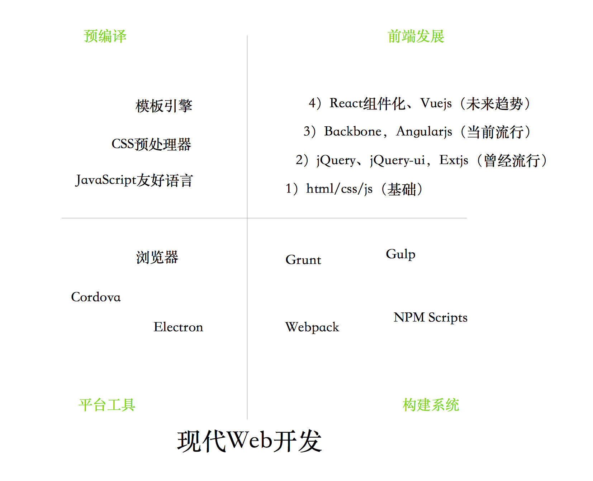

# 什么是NodeJS

JS是脚本语言，脚本语言都需要一个解析器才能运行。对于写在HTML页面里的JS，浏览器充当了解析器的角色。而对于需要独立运行的JS，NodeJS就是一个解析器。

每一种解析器都是一个运行环境，不但允许JS定义各种数据结构，进行各种计算，还允许JS使用运行环境提供的内置对象和方法做一些事情。例如运行在浏览器中的JS的用途是操作DOM，浏览器就提供了document之类的内置对象。而运行在NodeJS中的JS的用途是操作磁盘文件或搭建HTTP服务器，NodeJS就相应提供了fs、http等内置对象。

## 特点

* Node.js 运行在Chrome’s V8 上是一个JavaScript引擎
* Node.js 是基于事件驱动模型
* Node.js 是非阻塞IO(也叫异步IO)
* Node.js 单进程 (js代码跑在主线程)
* 轻量高高效

## 与浏览器端javascript异同点

`JavaScript：`

* ECMAScript(语言基础，如：语法、数据类型结构以及一些内置对象)
* DOM（一些操作页面元素的方法）
* BOM（一些操作浏览器的方法）

上面是JavaScript的组成部分，那么Nodejs呢？

`Nodejs：`

* ECMAScript(语言基础，如：语法、数据类型结构以及一些内置对象)
* os(操作系统)
* file(文件系统)
* net(网络系统)
* ....

## 应用场景

`Node.js能干什么？`

* 网站 (如express/koa等)
* im即时聊天(socket.io)
* api（移动端，pc，h5）
* http proxy（淘宝首页）
* 前端构建工具(grunt/gulp/bower/webpack/fis3…)
* 写操作系统（NodeOS）
* 跨平台打包工具（nw.js、electron、cordova/phonegap）
* 命令行工具（比如cordova）
* 编辑器（atom，vscode）

